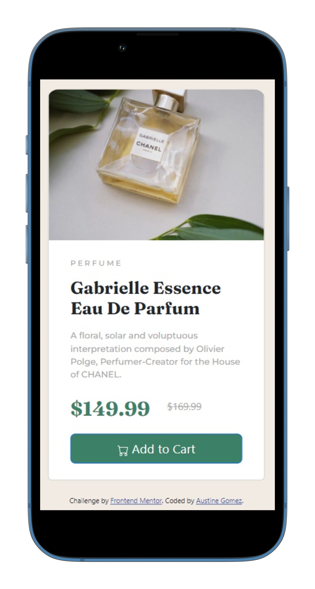

# Frontend Mentor - Product preview card component solution

### Screenshot

### Links

- Solution URL: [https://github.com/agomez99/ProductView](https://github.com/agomez99/ProductView)
- Live Site URL: [https://agomez99.github.io/ProductView/](https://agomez99.github.io/ProductView/)

## My process

### Built with

- Semantic HTML5 markup
- CSS custom properties
- Bootstrap

### What I learned

I used this example to get more fammiliar with Bootstrap

### Continued development
I would build this out in React for continued development

**Note: Delete this note and replace the list above with resources that helped you during the challenge. These could come in handy for anyone viewing your solution or for yourself when you look back on this project in the future.**

## Author

- Website - [https://www.austinegomez.com](https://www.austinegomez.com)
- Frontend Mentor - [@yourusername](https://www.frontendmentor.io/profile/yourusername)

**Note: Delete this note and add/remove/edit lines above based on what links you'd like to share.**
